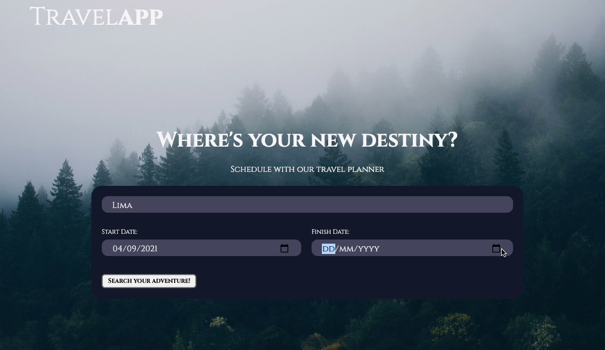

# TRAVEL APP 
***
Screenshot from APP


## Description: 
APP can take three inputs from the user: 
```
    - City
    - Start Date
    - Finish Date
```
This will make asynchronous fetch into different calls from 4 API's that will make a DIV card with all the data in just one step.
The data will return into a CARD in the HTML project to show the client the info of the travel plan.

This APP is responsive and will work great in any device.
***
### Start Requirement: 
Try the following steps:
```
    1. Clone the repo
    2. Install or update node and NPM
    3. Remember to make your ".env" file with the KEYS from the API's
    4. Run on your terminal NPM START
    5. The port where you can start the app is in "http://localhost:8000/"
    6. You can use Webpack in DEV or PROD buils
    7. Use NPM TEST for the test enviroment
```
***
### API's:
This project works with the next API's:
```
    1. GeoNames "https://www.geonames.org"
    2. WeatherBit  "https://www.weatherbit.io"
    3. Pixbay "https://pixabay.com"
    4. RestCountr "https://restcountries.eu"
```
This API's work asynchrounus to make the calls and fetch the data neccesary

